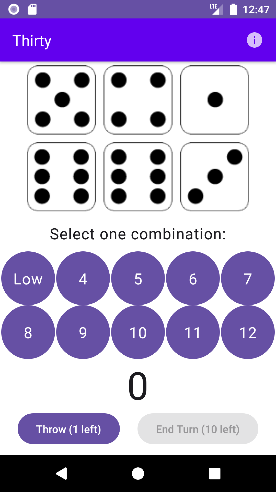
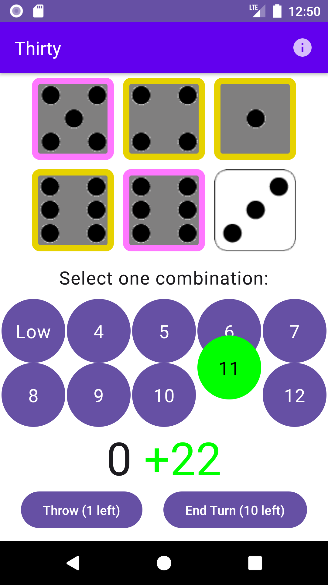

# Thirty: The Classic Dice Game 🎲

Welcome to **Thirty**, a classic dice game reimagined for mobile!

## Gameplay 🕹️
- **Start Fresh**: Kick off a new round by tapping the "New game" button and roll the dice.
- **Choose Wisely**: Select which dice to keep by tapping on them.
- **Roll Again**: Opt to roll again, up to a maximum of three times.
- **Pick a Combo**: After your rolls, choose a combination that you think will yield the highest score.
- **Aim for Thirty**: After 10 turns, check your highscore! Aim for 30 points or more to win.

## Screenshots 📸

### Main Screen

### Help Assist Feature
Need help choosing the best combination? There's a feature for that!  
The **Help Assist** suggests possible combinations for you. Pretty neat, right?

## Help Section ℹ️
Find all relevant information and rules in the "Help" section inside the game.
